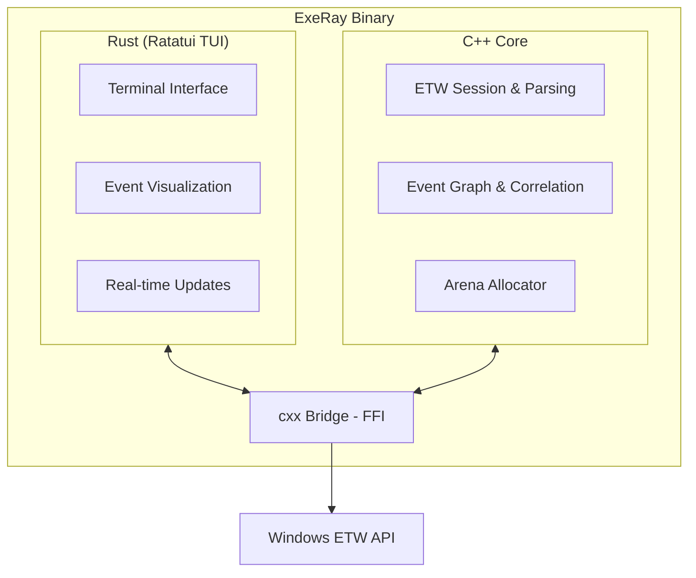

<p align="center">
  <h1 align="center">ExeRay</h1>
  <p align="center">Real-time Windows process behavior monitoring via ETW</p>
</p>

<p align="center">
  <a href="https://github.com/Muran-prog/ExeRay/actions/workflows/ci.yml"></a>
  <a href="LICENSE"></a>
  <a href="https://isocpp.org/"></a>
  <a href="https://www.rust-lang.org/"></a>
</p>

---

## What is ExeRay?

ExeRay captures and analyzes Windows system activity in real-time using Event Tracing for Windows (ETW). It monitors process behavior, detects suspicious patterns, and provides security-focused telemetry.

## Monitored Events

| Category | Events |
|----------|--------|
| **Process** | Create, Terminate, Image Load/Unload |
| **File System** | Create, Read, Write, Delete |
| **Registry** | Key Create/Open, Value Set/Delete |
| **Network** | TCP Connect/Accept/Send/Receive, UDP Send/Receive |
| **Memory** | VirtualAlloc, VirtualFree (RWX detection) |
| **Thread** | Start, End, Remote Injection Detection |
| **Script** | PowerShell Script Block Logging, Suspicious Pattern Detection |
| **AMSI** | Scan Results, Bypass Attempt Detection |

## Architecture



### Core Components

| Component | Description |
|-----------|-------------|
| **ETW Parsers** | Parse raw ETW events from 10+ providers (Kernel-Process, Kernel-File, AMSI, PowerShell, etc.) |
| **Event Graph** | Lock-free graph structure correlating events by process hierarchy and causality |
| **String Pool** | Deduplicated string storage with zero-copy access for paths, names, command lines |
| **Arena Allocator** | Cache-aligned (64-byte) bump allocator for zero-allocation hot paths |
| **Correlator** | Maps PIDs to process trees, tracks parent-child relationships across events |

### Security Detections

| Detection | Trigger |
|-----------|---------|
| Remote Thread Injection | Thread created in different process than creator |
| RWX Memory | VirtualAlloc with PAGE_EXECUTE_READWRITE |
| AMSI Bypass | Empty content scan from PowerShell |
| Suspicious Scripts | IEX, EncodedCommand, download cradles, Mimikatz patterns |
| DLL from Temp | Image loaded from %TEMP% or %APPDATA% |

## Building

### Requirements

- Windows 10/11 (ETW requires Windows)
- Visual Studio 2022+ with C++20 support
- Rust 1.85+
- CMake 3.20+

### Build

```bash
# Clone
git clone https://github.com/Muran-prog/ExeRay.git
cd ExeRay

# Build release
cargo build --release
```

### Run Tests

```bash
# C++ unit tests (Windows)
cmake -B build -G "Visual Studio 17 2022" -DBUILD_TESTING=ON
cmake --build build --config Debug
build\core\tests\Debug\exeray_unit_tests.exe
```

## Project Structure

```
ExeRay/
├── core/                    # C++ ETW engine
│   ├── include/exeray/
│   │   ├── etw/             # ETW session, parsers
│   │   ├── event/           # Event types, payloads
│   │   ├── arena.hpp        # Lock-free allocator
│   │   └── engine.hpp       # Main engine
│   ├── src/etw/             # Parser implementations
│   └── tests/unit/          # Google Test suite
├── crates/
│   ├── exeray-ffi/          # Rust-C++ bridge (cxx)
│   └── exeray/              # Terminal UI (Ratatui)
└── CMakeLists.txt
```

## License

[MIT](LICENSE)
